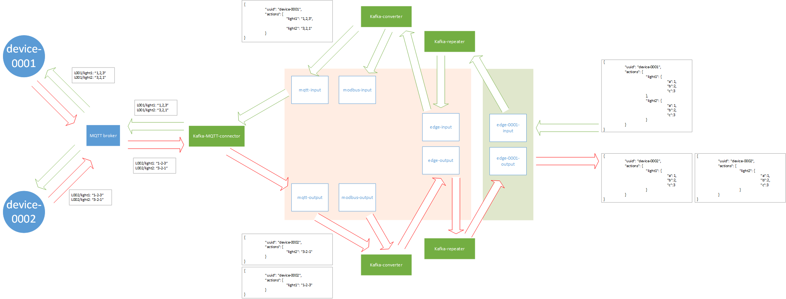

# IOT-EDGE

# Installation

Clone this repository:
~~~~
dsdsd
~~~~

Create data directories:
~~~~
./createDataDirs.sh
~~~~

Build docker images:
~~~~
docker-compose build
~~~~

Run docker-compose:
~~~~
./run.sh
~~~~

Create Kafka topics:
~~~~
./createTopics.sh
~~~~

Done!

# Running

Parameters are places in ".env" file. Change them if it is needed.
Then, run:

~~~~
./run.sh
~~~~
